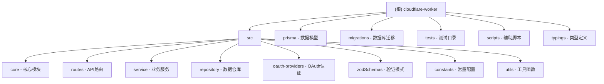

# cloudflare-worker 项目

> 基于 Cloudflare Workers 的 API 后端服务，部署于 api.littleeleven.com

---

## 变更记录 (Changelog)

| 时间 | 变更内容 |
|------|----------|
| 2026-04-07 14:39:05 | 初始化 AI 上下文文档 |

---

## 项目愿景

提供一个轻量、高性能的后端 API 服务，利用 Cloudflare Workers 的边缘计算能力，实现低延迟的用户认证和数据存储服务。主要服务于 littleeleven.com 相关产品线，支持 OAuth 多平台登录（Google、Discord、GitHub）。

---

## 架构总览

### 技术栈

| 层级 | 技术选型 |
|------|----------|
| 运行环境 | Cloudflare Workers (边缘计算) |
| Web 框架 | Hono + @hono/zod-openapi |
| 数据库 | Cloudflare D1 (SQLite) + Prisma ORM |
| 认证 | OAuth (Google/Discord/GitHub) + JWT |
| 缓存/临时存储 | Cloudflare KV |
| 测试 | Vitest + @cloudflare/vitest-pool-workers |
| 代码质量 | TypeScript + ESLint (@antfu/eslint-config) |

### 分层架构

```
请求 -> 中间件(OAuth/JWT验证) -> 路由层 -> 服务层 -> 仓库层 -> Prisma -> D1数据库
                                     |
                               KV (一次性票据)
```

---

## 模块结构图 (Mermaid)



---

## 模块索引

| 模块路径 | 职责描述 | 入口文件 |
|----------|----------|----------|
| `src/core` | 核心基础设施：Hono实例创建、Prisma初始化、服务依赖注入 | `index.ts`, `prisma.ts`, `request-services.ts` |
| `src/routes` | API路由定义：用户查询、记录CRUD、OpenAPI文档 | `records/index.ts`, `user/index.ts` |
| `src/service` | 业务逻辑层：认证服务(JWT/OAuth)、记录服务 | `auth.service.ts`, `record.service.ts` |
| `src/repository` | 数据访问层：用户仓库、记录仓库 | `user.repository.ts`, `record.repository.ts` |
| `src/oauth-providers` | OAuth认证中间件：路由保护、票据机制 | `oauth.middleware.ts` |
| `src/zodSchemas` | Zod验证模式：请求/响应验证、OpenAPI集成 | `*.ts` |
| `prisma` | 数据模型定义、Prisma Client生成、Zod类型生成 | `schema.prisma` |
| `tests` | 单元测试与E2E测试 | `hash.spec.ts`, `e2e/*.spec.ts` |

---

## 运行与开发

### 环境要求

- Node.js >= 18
- pnpm >= 10.33.0
- Wrangler CLI (Cloudflare Workers 开发工具)

### 关键命令

```bash
# 安装依赖 (含 Prisma 生成)
pnpm install

# 本地开发 (端口 12345)
pnpm start:local

# 远程预览
pnpm start:remote

# 部署到 Cloudflare
pnpm deploy

# 类型检查
pnpm tsc-check

# ESLint 检查与修复
pnpm lint

# 单元测试
pnpm unit:test

# E2E 测试
pnpm e2e:test

# D1 数据库迁移
pnpm d1:migrations:init          # 从 Prisma schema 生成 SQL
pnpm d1:migrations:create-local  # 创建本地迁移
pnpm d1:migrations:deploy-local  # 应用本地迁移
pnpm d1:migrations:deploy-remote # 应用远程迁移

# Wrangler 登录
pnpm login
```

### 环境变量

通过 `.dev.vars` (本地) 或 Wrangler 配置管理：

| 变量名 | 说明 |
|--------|------|
| `JWT_SECRET` | JWT 签名密钥 |
| `ENVIRONMENT` | 环境标识 (local/production) |
| `DB` | D1 数据库绑定 |
| `KV` | KV 存储绑定 |

---

## 数据模型

### User 表 (users)

| 字段 | 类型 | 说明 |
|------|------|------|
| `id` | TEXT (UUID) | 主键 |
| `email` | TEXT | 邮箱 (唯一) |
| `nickname` | TEXT? | 昵称 |
| `avatar` | TEXT? | 头像URL |
| `discordId` | TEXT? | Discord ID (唯一) |
| `githubId` | TEXT? | GitHub ID (唯一) |
| `googleId` | TEXT? | Google ID (唯一) |
| `createdAt` | DATETIME | 创建时间 |
| `updatedAt` | DATETIME | 更新时间 |

### Record 表 (records)

| 字段 | 类型 | 说明 |
|------|------|------|
| `id` | TEXT (UUID) | 主键 |
| `data` | TEXT | JSON数据 |
| `createdAt` | DATETIME | 创建时间 |
| `updatedAt` | DATETIME | 更新时间 |

---

## API 路由

### 公开路由 (无需认证)

| 路径 | 方法 | 说明 |
|------|------|------|
| `/api/test/ping` | GET | 健康检查 |
| `/api/doc` | GET | OpenAPI 3.1 文档 |
| `/api/records/{id}` | GET | 获取记录 |
| `/api/records/{id}` | POST | 创建/更新记录 |
| `/api/auth/google` | GET | Google OAuth 登录 |
| `/api/auth/discord` | GET | Discord OAuth 登录 |
| `/api/auth/github` | GET | GitHub OAuth 登录 |
| `/api/auth/by-ticket` | GET | 通过票据换取Token |

### 认证路由 (需要 JWT)

| 路径 | 方法 | 说明 |
|------|------|------|
| `/api/user/current` | GET | 获取当前用户信息 |

---

## 测试策略

### 测试框架

- Vitest + @cloudflare/vitest-pool-workers
- 支持 Cloudflare Workers 环境的真实模拟

### 测试类型

| 类型 | 文件位置 | 说明 |
|------|----------|------|
| 单元测试 | `tests/*.spec.ts` | 纯函数测试 |
| E2E测试 | `tests/e2e/*.spec.ts` | API端点集成测试 |

### 测试配置

- `vitest.config.ts`: Vitest 配置，集成 D1 迁移
- `.vitest/apply-migrations.ts`: 测试前自动应用数据库迁移

---

## 编码规范

### TypeScript

- 目标: ESNext
- 模块: ESNext
- 模块解析: Bundler
- 严格模式开启
- 路径别名: `@/*` -> `src/*`, `#/*` -> `./`

### ESLint

- 使用 `@antfu/eslint-config`
- 自动修复: `pnpm lint`

### 文件组织

- 路由: `src/routes/{module}/{feature}.ts`
- 服务: `src/service/{module}.service.ts`
- 仓库: `src/repository/{entity}.repository.ts`
- 验证: `src/zodSchemas/{schema}.ts`

---

## AI 使用指引

### 修改代码时注意

1. **Prisma 迁移流程**：修改 `prisma/schema.prisma` 后需执行迁移命令
2. **OAuth 认证**：新增公开路由需添加到 `src/constants/public-paths.ts`
3. **服务依赖注入**：新服务需注册到 `src/core/request-services.ts`
4. **Zod 验证**：API路由使用 `@hono/zod-openapi` 的 `createRoute` 定义

### 常见任务指引

| 任务 | 关键文件 |
|------|----------|
| 新增API路由 | `src/routes/`, `src/constants/public-paths.ts` |
| 新增数据模型 | `prisma/schema.prisma`, `migrations/` |
| 新增OAuth Provider | `src/oauth-providers/oauth.middleware.ts` |
| 修改认证逻辑 | `src/service/auth.service.ts` |
| 修改 CORS 配置 | `src/server.ts` |

---

## 目录详情

### src 目录

核心源代码目录，包含所有业务逻辑：

- `index.ts` - 应用入口，注册路由
- `server.ts` - Hono 实例配置，全局中间件
- `core/` - 基础设施
- `routes/` - API 路由
- `service/` - 业务服务
- `repository/` - 数据仓库
- `oauth-providers/` - OAuth 认证
- `zodSchemas/` - Zod 验证模式
- `constants/` - 常量配置
- `utils/` - 工具函数

### prisma 目录

Prisma ORM 相关文件：

- `schema.prisma` - 数据模型定义
- `client/` - 生成的 Prisma Client (D1 适配)
- `zod/` - 生成的 Zod 验证模式

### tests 目录

测试文件目录：

- `hash.spec.ts` - 工具函数测试
- `e2e/test-endpoint.e2e.spec.ts` - API 端点测试

### migrations 目录

D1 数据库迁移 SQL 文件：

- `prisma-generated.sql` - Prisma 生成的完整迁移
- `20260403_add_records_table.sql` - Record 表迁移

---

## 相关文件清单

| 类别 | 文件路径 |
|------|----------|
| 入口 | `src/index.ts`, `src/server.ts` |
| 配置 | `wrangler.toml`, `tsconfig.json`, `package.json`, `vitest.config.ts` |
| 数据模型 | `prisma/schema.prisma` |
| 迁移 | `migrations/prisma-generated.sql`, `migrations/20260403_add_records_table.sql` |
| 类型定义 | `typings/bindings.d.ts`, `env.d.ts` |
| 核心模块 | `src/core/*.ts` |
| 认证 | `src/oauth-providers/oauth.middleware.ts`, `src/service/auth.service.ts` |
| 路由 | `src/routes/**/*.ts` |
| 测试 | `tests/**/*.ts`, `.vitest/apply-migrations.ts` |
| 脚本 | `scripts/*.js` |